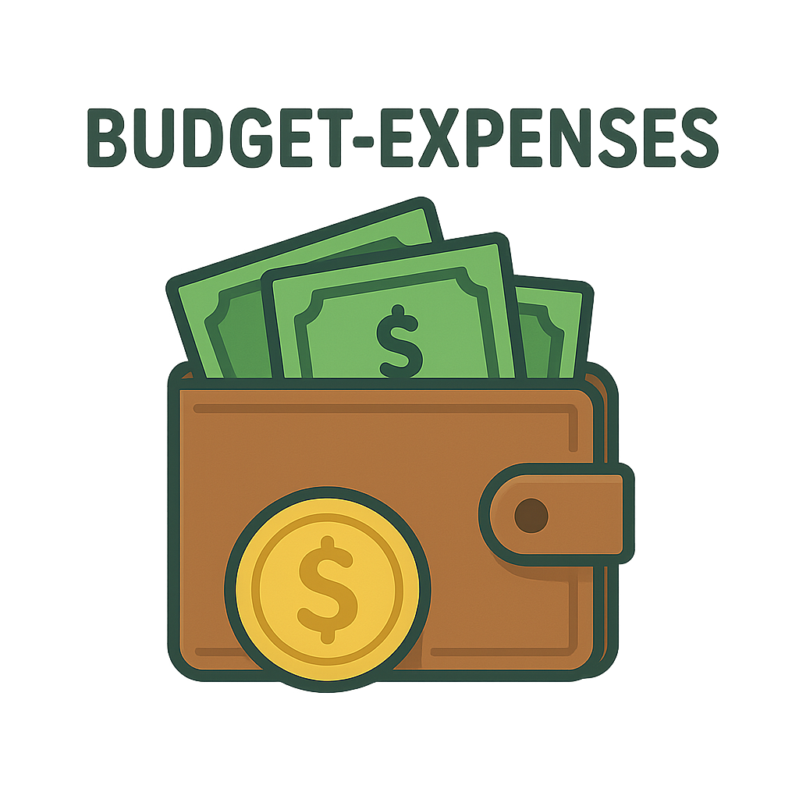

# Oink Budget just another buget app

Oink Budget is a cross-platform personal finance app built with Expo Router, SQLite, NativeWind, and GluestackUI. It helps you manage accounts, budgets, and transaction history locally on your device.

**Description**
- A simple personal finance manager for tracking income, expenses, accounts, and budgets.
- Built with React Native (Expo) and local SQLite storage for offline use.

**Installation**
- Prerequisites: `Node.js` (16+), `npm`, Android Studio (for Android emulator, optional).
- Clone the repo and install dependencies:

```bash
git clone <repo-url>
cd oinkbudget
npm install
```

- Start the development server:

```bash
npm start
# On Windows (Android):
npm run android
# On macOS (iOS simulator):
npm run ios
```

You can also use `npx expo start` if you prefer.